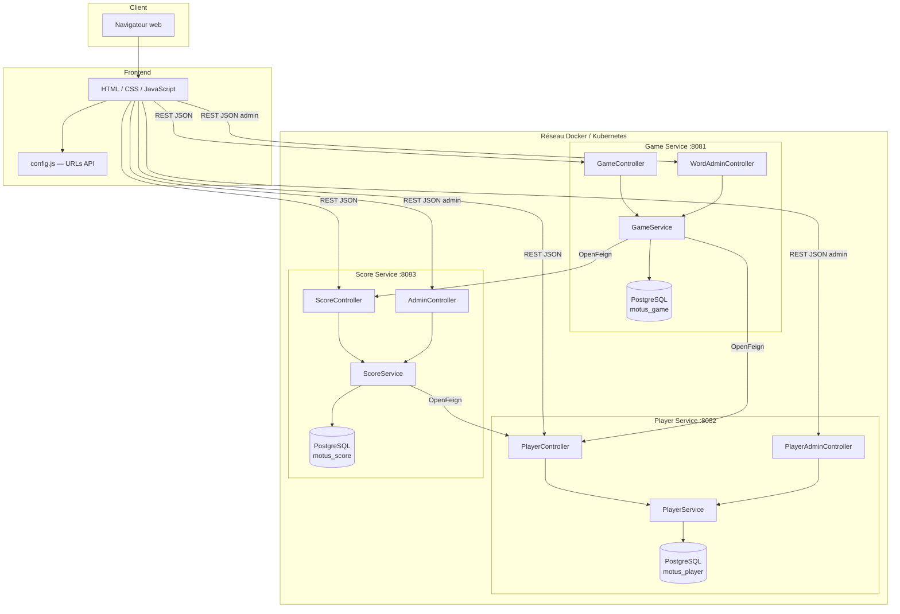
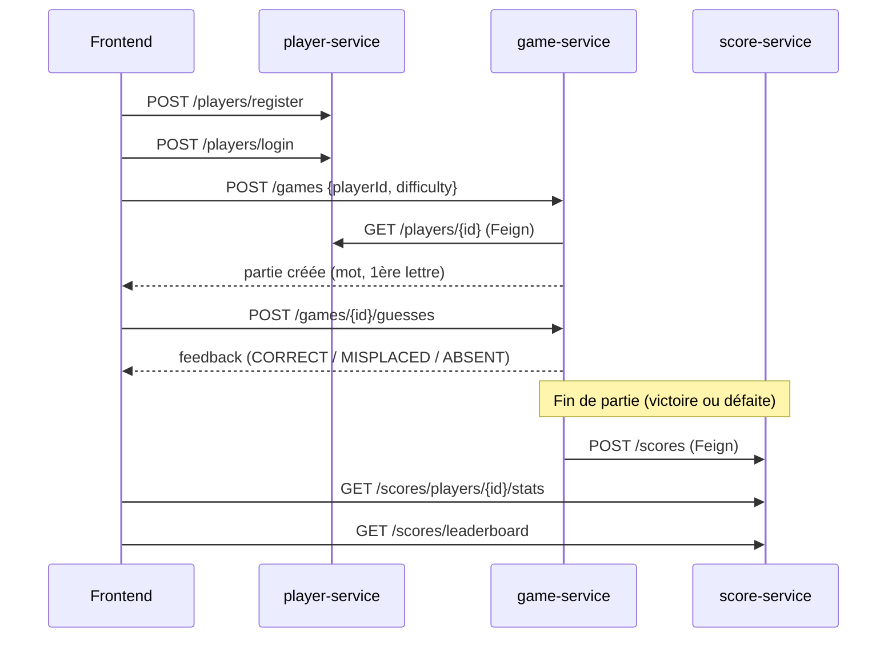
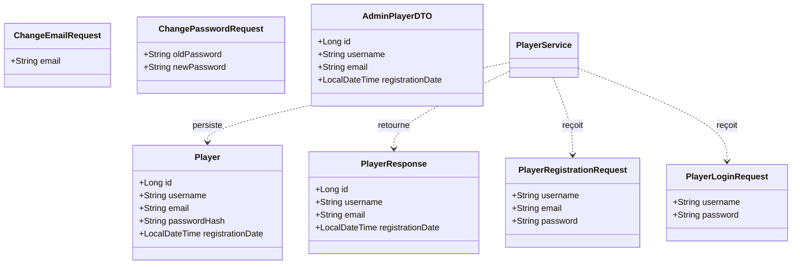
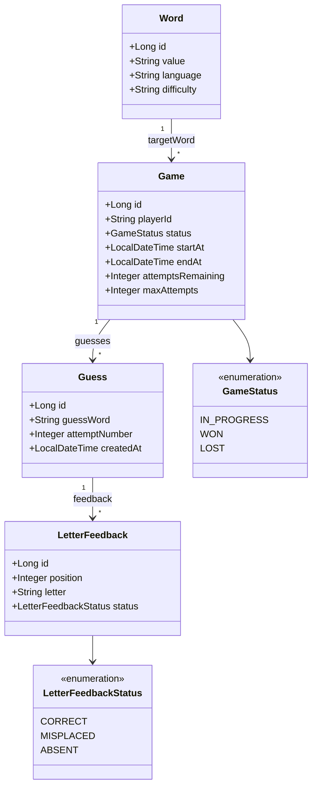
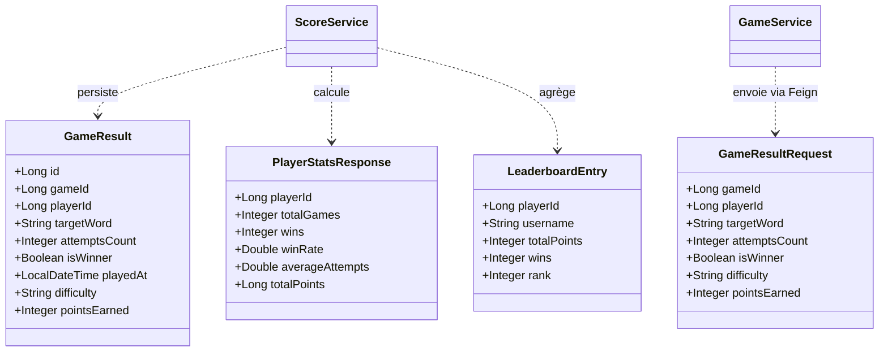
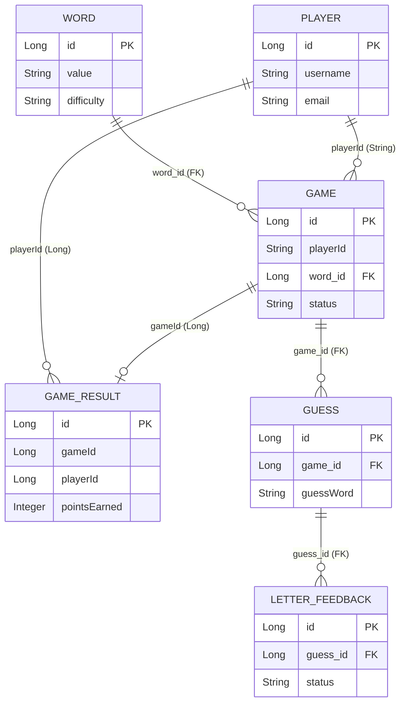

# Motus — Application Microservices

Jeu de devinette de mots (type Wordle / Motus) en architecture **microservices** : trois services Spring Boot indépendants, chacun avec sa propre base PostgreSQL, exposés via **API REST** et consommés par un frontend HTML/CSS/JavaScript.

---

## Table des matières

1. [Exécution du projet](#1-exécution-du-projet)
2. [Schéma d'architecture](#2-schéma-darchitecture)
3. [Choix techniques](#3-choix-techniques)
4. [Diagramme de classes (architecture)](#4-diagramme-de-classes-architecture)
5. [Diagrammes de classes métiers](#5-diagrammes-de-classes-métiers)
6. [Endpoints API REST](#6-endpoints-api-rest)
7. [Structure du projet](#7-structure-du-projet)

---

## 1. Exécution du projet

### Prérequis

| Outil | Usage |
|-------|-------|
| **Docker** + **Docker Compose** | Démarrage local (recommandé) |
| Navigateur web | Frontend |
| **Minikube** + **kubectl** (optionnel) | Déploiement Kubernetes local |

> Maven et Java ne sont pas requis en local : la compilation se fait dans les conteneurs Docker.

### Option A — Docker Compose (développement local)

```bash
cd Projet
docker compose up --build
```

Ce que fait cette commande :
1. Compile chaque microservice (Maven multi-stage)
2. Démarre 3 bases **PostgreSQL 16** (`player-db`, `game-db`, `score-db`) avec volumes persistants
3. Lance les 3 microservices sur les ports **8081**, **8082**, **8083**
4. Charge automatiquement le dictionnaire Motus (~77 000 mots, 6–10 lettres) via le conteneur `dictionary-loader`

**Accéder au frontend** :

```bash
# Ouvrir directement le fichier
open frontend/index.html

# Ou via un serveur HTTP local
cd frontend && python3 -m http.server 3000
# → http://localhost:3000
```

**Vérifier les services** :

| Service | URL de test |
|---------|-------------|
| Player Service | http://localhost:8082/actuator/health |
| Game Service | http://localhost:8081/actuator/health |
| Score Service | http://localhost:8083/actuator/health |
| Classement | http://localhost:8083/scores/leaderboard |

**Arrêter** : `Ctrl+C` puis `docker compose down`

**Reconstruire après modification** :

```bash
docker compose up --build player-service   # un seul service
docker compose up --build                # tout reconstruire
```

### Option B — Minikube (Kubernetes local)

```bash
chmod +x scripts/deploy-minikube.sh scripts/open-minikube-frontend.sh
./scripts/deploy-minikube.sh
```

**Accès au frontend** (macOS + driver Docker) :

```bash
# Terminal 1 — laisser ouvert
./scripts/open-minikube-frontend.sh

# Navigateur
# http://localhost:30080
```

> Sur Mac, l'URL `http://<IP-minikube>:30080` affichée à la fin du déploiement provoque un timeout dans le navigateur. Utilisez le tunnel ci-dessus.

Documentation détaillée : [docs/MINIKUBE.md](docs/MINIKUBE.md)

**Arrêter Minikube** : `minikube stop`

**Supprimer le déploiement** : `./scripts/cleanup-minikube.sh`

---

## 2. Schéma d'architecture

### Vue d'ensemble



### Découpage microservices

| Microservice | Port | Base de données | Responsabilité |
|--------------|------|-----------------|----------------|
| **player-service** | 8082 | `motus_player` | Comptes joueurs, authentification (BCrypt), gestion admin des utilisateurs |
| **game-service** | 8081 | `motus_game` | Dictionnaire de mots, parties en cours, tentatives, feedback lettres |
| **score-service** | 8083 | `motus_score` | Résultats de parties, statistiques, classement, admin des résultats |

Chaque service possède **sa propre base PostgreSQL** (principe *database per service*).

### Communication inter-services



- **Protocole** : HTTP synchrone, JSON
- **Client** : Spring Cloud **OpenFeign**
- **Résilience** : try/catch sur les appels Feign (le classement fonctionne même si `player-service` est indisponible)

### Déploiement

| Mode | Orchestration | Accès frontend |
|------|---------------|----------------|
| Docker Compose | `docker-compose.yml` | Fichier local ou `localhost:3000` |
| Minikube | Manifests `k8s/` + nginx reverse proxy | `localhost:30080` via `./scripts/open-minikube-frontend.sh` |

---

## 3. Choix techniques

### Backend

| Choix | Justification |
|-------|---------------|
| **Spring Boot 4.0.6** | Framework standard Java pour APIs REST, injection de dépendances, configuration |
| **Java 25** | Version récente du JDK |
| **Spring Data JPA** | Abstraction ORM, requêtes typées, specifications pour la recherche admin |
| **PostgreSQL 16** | Base relationnelle robuste, persistance des données, support du dictionnaire volumineux (~400k mots) |
| **Spring Cloud OpenFeign** | Communication déclarative inter-services (moins de boilerplate qu'un RestTemplate) |
| **Spring HATEOAS** | Réponses enrichies avec liens hypermédia (`EntityModel`) |
| **Spring Actuator** | Health checks (`/actuator/health`) pour Docker et Kubernetes |
| **BCrypt** (Spring Security Crypto) | Hachage sécurisé des mots de passe |
| **Lombok** | Réduction du code boilerplate (`@Data`, `@Builder`, etc.) |
| **Database per service** | Isolation des données, indépendance de déploiement de chaque microservice |

### Frontend

| Choix | Justification |
|-------|---------------|
| **HTML / CSS / JavaScript vanilla** | Pas de framework lourd, simplicité, démonstration claire des appels REST |
| **Fetch API** | Requêtes HTTP asynchrones natives |
| **config.js** | URLs API configurables (localhost en dev, même origine via nginx en Minikube) |

### DevOps

| Choix | Justification |
|-------|---------------|
| **Docker multi-stage** | Image légère (JRE seul en runtime, Maven en build) |
| **Docker Compose** | Orchestration locale simple, healthchecks, réseau interne |
| **Minikube + Kubernetes** | Déploiement cloud-native (Deployments, Services, Jobs, PVC, Secrets) |
| **nginx** (Minikube) | Reverse proxy : un seul point d'entrée, pas de problème CORS |

### Sécurité

| Aspect | Implémentation |
|--------|----------------|
| Mots de passe joueurs | BCrypt, règles : 8+ caractères, majuscule, minuscule, chiffre |
| Connexion | Par **pseudo** (pas par e-mail) |
| Admin | Header `X-Admin-Password` (mot de passe : `0000`) |
| CORS | `@CrossOrigin(origins = "*")` sur les contrôleurs |

### Règles métier du jeu

| Règle | Détail |
|-------|--------|
| Tentatives | 6 essais maximum par partie |
| Difficulté | Facile (1 pt), Moyen (2 pts), Difficile (3 pts) — points en cas de victoire uniquement |
| Feedback | CORRECT (vert), MISPLACED (orange), ABSENT (gris) |
| Dictionnaire | Français-GUTenberg filtré selon les règles Motus (noms communs, infinitifs, participes ; 6–10 lettres) |

---

## 4. Diagramme de classes (architecture)

Vue en couches de chaque microservice (pattern Controller → Service → Repository → Entity).

```mermaid
classDiagram
    direction TB

    class PlayerController {
        +registerPlayer()
        +login()
        +changeEmail()
        +changePassword()
        +getPlayer()
    }
    class PlayerAdminController {
        +searchPlayers()
        +createPlayer()
        +updatePlayer()
        +deletePlayer()
    }
    class PlayerService {
        +registerPlayer()
        +login()
        +changeEmail()
        +changePassword()
    }
    class PlayerAdminService {
        +searchPlayers()
        +createPlayer()
        +updatePlayer()
        +deletePlayer()
    }
    class PlayerRepository {
        <<interface>>
        +findByUsername()
        +findByEmail()
    }
    class Player {
        +Long id
        +String username
        +String email
        +String passwordHash
    }

    class GameController {
        +startGame()
        +submitGuess()
        +getGame()
    }
    class WordAdminController {
        +searchWords()
        +createWord()
        +updateWord()
        +deleteWord()
    }
    class GameService {
        +startNewGame()
        +submitGuess()
        +getGame()
    }
    class WordAdminService {
        +searchWords()
        +createWord()
        +updateWord()
        +deleteWord()
    }
    class GameRepository {
        <<interface>>
    }
    class WordRepository {
        <<interface>>
    }
    class PlayerClient {
        <<Feign>>
        +getPlayer()
    }
    class ScoreClient {
        <<Feign>>
        +recordResult()
    }

    class ScoreController {
        +recordResult()
        +getPlayerStats()
        +getLeaderboard()
    }
    class AdminController {
        +searchResults()
        +updateResult()
        +deleteResult()
    }
    class ScoreService {
        +recordResult()
        +getPlayerStats()
        +getLeaderboard()
    }
    class AdminService {
        +searchResults()
        +updateResult()
        +deleteResult()
    }
    class GameResultRepository {
        <<interface>>
    }
    class PlayerClient2 {
        <<Feign>>
        +getPlayer()
    }

    namespace player_service {
        PlayerController --> PlayerService
        PlayerAdminController --> PlayerAdminService
        PlayerService --> PlayerRepository
        PlayerAdminService --> PlayerRepository
        PlayerRepository --> Player
    }

    namespace game_service {
        GameController --> GameService
        WordAdminController --> WordAdminService
        GameService --> GameRepository
        GameService --> WordRepository
        GameService --> PlayerClient
        GameService --> ScoreClient
    }

    namespace score_service {
        ScoreController --> ScoreService
        AdminController --> AdminService
        ScoreService --> GameResultRepository
        ScoreService --> PlayerClient2
        AdminService --> GameResultRepository
        AdminService --> PlayerClient2
    }
```

---

## 5. Diagrammes de classes métiers

### 5.1 — Domaine Player (player-service)



### 5.2 — Domaine Game (game-service)



### 5.3 — Domaine Score (score-service)



### Relations inter-domaines (référence par ID)

Les microservices ne partagent pas de base de données. Les liens sont logiques :



> `PLAYER` vit dans `motus_player`, `GAME`/`WORD`/`GUESS` dans `motus_game`, `GAME_RESULT` dans `motus_score`.

---

## 6. Endpoints API REST

### player-service (`/players`)

| Méthode | Endpoint | Description |
|---------|----------|-------------|
| `POST` | `/players/register` | Créer un compte (pseudo, e-mail, mot de passe) |
| `POST` | `/players/login` | Connexion par pseudo |
| `PUT` | `/players/{id}/email` | Modifier son e-mail |
| `PUT` | `/players/{id}/password` | Modifier son mot de passe |
| `GET` | `/players/{id}` | Profil d'un joueur |
| `GET` | `/players/search?username=` | Recherche par pseudo |

**Admin** (`/players/admin/users`, header `X-Admin-Password: 0000`) :

| Méthode | Endpoint | Description |
|---------|----------|-------------|
| `GET` | `/players/admin/users` | Liste paginée + recherche |
| `POST` | `/players/admin/users` | Créer un compte |
| `PUT` | `/players/admin/users/{id}` | Modifier un compte |
| `DELETE` | `/players/admin/users/{id}` | Supprimer un compte |

### game-service (`/games`)

| Méthode | Endpoint | Description |
|---------|----------|-------------|
| `POST` | `/games` | Démarrer une partie `{playerId, difficulty}` |
| `GET` | `/games/{gameId}` | État d'une partie |
| `POST` | `/games/{gameId}/guesses` | Soumettre une tentative |

**Admin dictionnaire** (`/games/admin/words`, header `X-Admin-Password: 0000`) :

| Méthode | Endpoint | Description |
|---------|----------|-------------|
| `GET` | `/games/admin/words` | Liste paginée + filtres |
| `POST` | `/games/admin/words` | Ajouter un mot |
| `PUT` | `/games/admin/words/{id}` | Modifier un mot |
| `DELETE` | `/games/admin/words/{id}` | Supprimer un mot |

### score-service (`/scores`)

| Méthode | Endpoint | Description |
|---------|----------|-------------|
| `POST` | `/scores` | Enregistrer un résultat (appelé par game-service) |
| `GET` | `/scores/players/{playerId}/stats` | Statistiques d'un joueur |
| `GET` | `/scores/leaderboard` | Classement global (tri par points) |

**Admin résultats** (`/scores/admin`, header `X-Admin-Password: 0000`) :

| Méthode | Endpoint | Description |
|---------|----------|-------------|
| `POST` | `/scores/admin/login` | Vérifier le mot de passe admin |
| `GET` | `/scores/admin/results` | Recherche paginée |
| `PUT` | `/scores/admin/results/{id}` | Modifier un résultat |
| `DELETE` | `/scores/admin/results/{id}` | Supprimer un résultat |

---

## 7. Structure du projet

```
Projet/
├── docker-compose.yml              # Orchestration locale
├── README.md
├── docs/
│   └── MINIKUBE.md                 # Guide déploiement Kubernetes
├── scripts/
│   ├── deploy-minikube.sh
│   ├── open-minikube-frontend.sh   # Tunnel navigateur (Mac)
│   ├── cleanup-minikube.sh
│   └── load-dictionary.sh
├── k8s/                            # Manifests Kubernetes
│   ├── namespace.yaml
│   ├── secrets.yaml
│   ├── *-db.yaml, *-service.yaml
│   ├── frontend/                   # nginx + proxy
│   └── dictionary-loader/
├── backend/
│   ├── player-service/             # Port 8082 — comptes joueurs
│   ├── game-service/               # Port 8081 — jeu + dictionnaire
│   └── score-service/              # Port 8083 — scores + classement
└── frontend/
    ├── index.html
    ├── style.css
    ├── app.js
    └── config.js                   # URLs API (localhost)
```

---

## Licence

Projet académique — Université Paris Dauphine, Architecture Microservices 2026.
