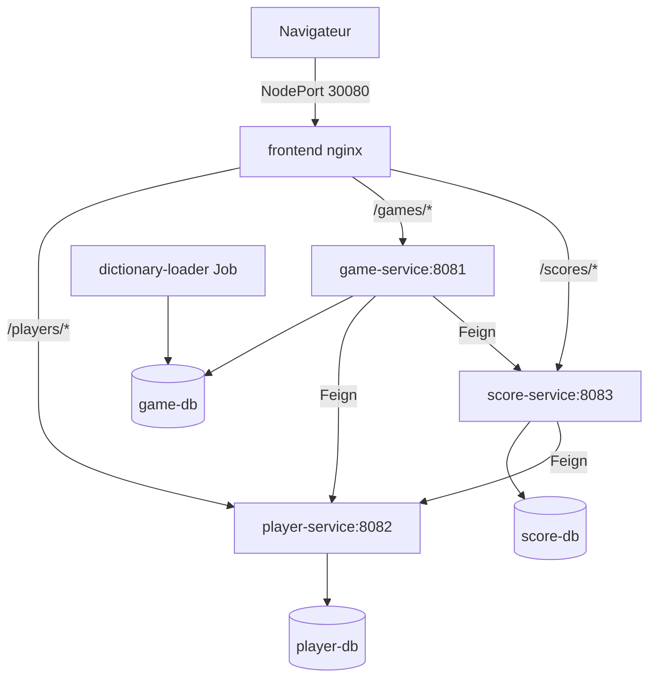

# Déploiement Minikube — Motus

Ce guide explique comment déployer l'application Motus sur un cluster Kubernetes local avec **Minikube**, et comment l'architecture fonctionne.

## Prérequis

- [Minikube](https://minikube.sigs.k8s.io/docs/start/)
- [kubectl](https://kubernetes.io/docs/tasks/tools/)
- Docker (utilisé par le driver Minikube)

## Déploiement en une commande

```bash
chmod +x scripts/deploy-minikube.sh scripts/cleanup-minikube.sh
./scripts/deploy-minikube.sh
```

Le script :
1. Démarre Minikube si nécessaire
2. Pointe Docker vers le daemon de Minikube (`eval $(minikube docker-env)`)
3. Construit les 5 images localement
4. Applique tous les manifests dans le namespace `motus`
5. Lance le Job de chargement du dictionnaire
6. Affiche l'URL d'accès au frontend

Accès : **http://localhost:30080** (via tunnel — voir ci-dessous)

> **macOS + driver Docker** : l'URL `http://<IP-minikube>:30080` affichée par Minikube **ne fonctionne pas** directement dans le navigateur (timeout). C'est normal. Utilisez le tunnel :

```bash
# Terminal 1 : laisser ouvert
./scripts/open-minikube-frontend.sh

# Puis ouvrir dans le navigateur :
# http://localhost:30080
```

Alternative (tunnel Minikube intégré, terminal ouvert) :
```bash
minikube service frontend -n motus
```

Sur Linux ou avec le driver `vfkit`, l'accès direct peut fonctionner :
`http://<IP-minikube>:30080`

## Nettoyage

```bash
./scripts/cleanup-minikube.sh
```

Supprime le namespace `motus` et toutes les ressources associées (pods, services, PVC, secrets).

---

## Architecture Kubernetes



### Namespace `motus`

Toutes les ressources sont isolées dans un namespace dédié (`k8s/namespace.yaml`). Cela permet de déployer plusieurs projets sur le même cluster sans conflit de noms.

### Bases de données (PostgreSQL)

Trois instances PostgreSQL indépendantes, une par microservice :

| Service | Pod | Base | PVC |
|---------|-----|------|-----|
| player-service | `player-db` | `motus_player` | 1 Gi |
| game-service | `game-db` | `motus_game` | 2 Gi |
| score-service | `score-db` | `motus_score` | 1 Gi |

Les identifiants sont stockés dans un **Secret** Kubernetes (`motus-db-secret`) et injectés via `secretKeyRef` dans les variables d'environnement des pods.

Chaque base a un **PersistentVolumeClaim** : les données survivent au redémarrage des pods.

### Microservices Spring Boot

Chaque service est un **Deployment** (1 réplica) + un **Service** ClusterIP :

- `player-service` → port 8082
- `game-service` → port 8081
- `score-service` → port 8083

**Init containers** : avant le démarrage, des conteneurs `busybox` attendent que les dépendances (bases PostgreSQL, autres services) soient accessibles via le réseau interne Kubernetes.

**DNS interne** : dans le cluster, les services se résolvent par leur nom (`player-service`, `game-db`, etc.). C'est compatible avec les clients OpenFeign déjà configurés dans le code (`http://player-service:8082`, etc.).

**imagePullPolicy: Never** : les images sont construites localement dans le daemon Docker de Minikube, pas tirées d'un registry distant.

**Health checks** : `readinessProbe` et `livenessProbe` sur `/actuator/health`.

### Job `dictionary-loader`

Le fichier dictionnaire (~4 Mo, ~400 000 mots) est trop volumineux pour une ConfigMap. On utilise donc :

1. Une image Docker dédiée (`motus-dictionary-loader`) qui embarque le fichier et le script `load-dictionary.sh`
2. Un **Job** Kubernetes qui s'exécute une fois après le démarrage de `game-service`

Le script vérifie si la table `words` est déjà remplie ; si oui, il ne fait rien (idempotent).

### Frontend (nginx)

Le frontend n'est plus servi en fichier local. Il tourne dans un pod **nginx** qui :

1. Sert les fichiers statiques (`index.html`, `app.js`, `style.css`)
2. **Proxifie** les appels API vers les microservices :
   - `/players/*` → `player-service:8082`
   - `/games/*` → `game-service:8081`
   - `/scores/*` → `score-service:8083`

Le fichier `config.k8s.js` (copié comme `config.js` dans l'image) configure le frontend pour utiliser la **même origine** (`window.location.origin`). Le navigateur n'appelle plus `localhost:8081/8082/8083` mais `http://<minikube>:30080/players/...`, etc.

Le Service frontend est de type **NodePort** (port 30080) pour être accessible depuis l'hôte sans Ingress.

---

## Différences avec Docker Compose

| Aspect | Docker Compose | Minikube |
|--------|----------------|----------|
| Orchestration | `docker compose up` | Kubernetes (Deployments, Services, Jobs) |
| Réseau | `motus-network` bridge | DNS interne du cluster |
| Persistance | Volumes Docker nommés | PersistentVolumeClaims |
| Frontend | Fichier local ou serveur HTTP | Pod nginx + proxy inverse |
| Dictionnaire | Conteneur one-shot | Job Kubernetes |
| Accès externe | Ports mappés (8081-8083) | NodePort 30080 (point d'entrée unique) |
| Secrets | Variables en clair dans compose | Secret K8s |

---

## Commandes utiles

```bash
# État des pods
kubectl get pods -n motus

# Logs d'un service
kubectl logs -f deployment/game-service -n motus

# Redémarrer un déploiement
kubectl rollout restart deployment/game-service -n motus

# Shell dans un pod
kubectl exec -it deployment/game-service -n motus -- sh

# Vérifier le Job dictionnaire
kubectl get jobs -n motus
kubectl logs job/dictionary-loader -n motus
```

## Données et comptes joueurs

Minikube utilise ses **propres bases PostgreSQL** (PVC Kubernetes), indépendantes de Docker Compose. Les comptes créés en local avec `docker compose up` **n'existent pas** dans le déploiement Minikube.

Après un déploiement Minikube, il faut **créer un nouveau compte** via l'interface (onglet inscription). Les données persistent tant que le namespace `motus` et ses PVC ne sont pas supprimés (`cleanup-minikube.sh` efface tout).

---

## Dépannage

**Connexion expirée / timeout sur http://192.168.x.x:30080 (Mac)**

Cause : avec le **driver Docker sur macOS**, l'IP Minikube n'est pas routable depuis le navigateur.

Solution :
```bash
./scripts/open-minikube-frontend.sh
# Puis ouvrir http://localhost:30080 (laisser le terminal ouvert)
```

**Image non trouvée (ImagePullBackOff)**  
Vérifiez que vous avez bien exécuté `eval $(minikube docker-env)` avant le `docker build`, ou relancez `./scripts/deploy-minikube.sh`.

**Pod en CrashLoopBackOff**  
Consultez les logs : `kubectl logs <pod> -n motus`. Souvent un problème de connexion à la base (attendre que les init containers terminent).

**Frontend inaccessible**  
Vérifiez que Minikube tourne : `minikube status`. Testez : `curl http://$(minikube ip):30080`.

**Dictionnaire vide**  
Relancez le Job :
```bash
kubectl delete job dictionary-loader -n motus
kubectl apply -f k8s/dictionary-loader/job.yaml
kubectl wait --for=condition=complete job/dictionary-loader -n motus --timeout=600s
```
